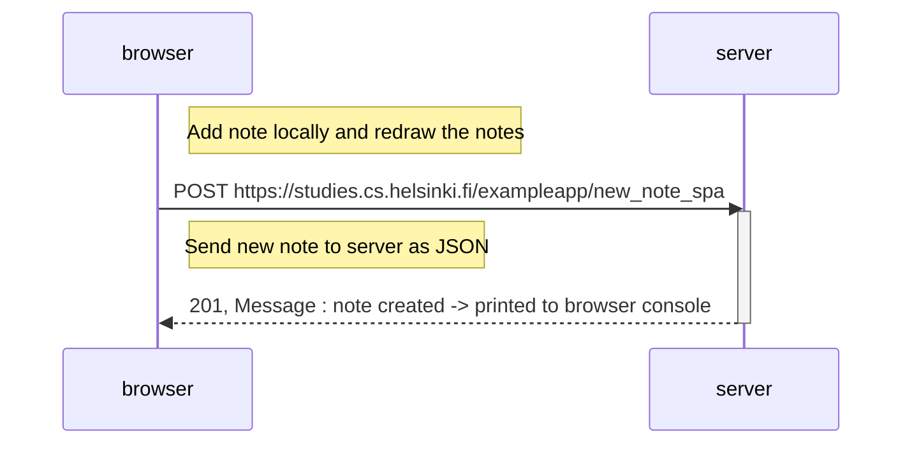

```mermaid
sequenceDiagram
    participant browser
    participant server
    
    Note right of browser: Add note locally and redraw the notes
    browser->>server: POST https://studies.cs.helsinki.fi/exampleapp/new_note_spa
    activate server
    Note right of browser: Send new note to server as JSON
    server-->>browser: 201, Message : note created -> printed to browser console
    deactivate server

```